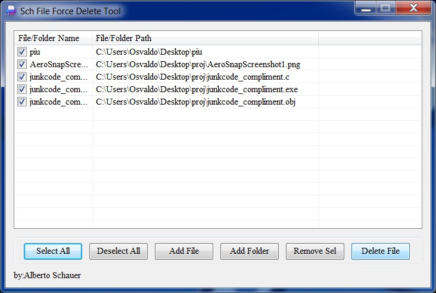
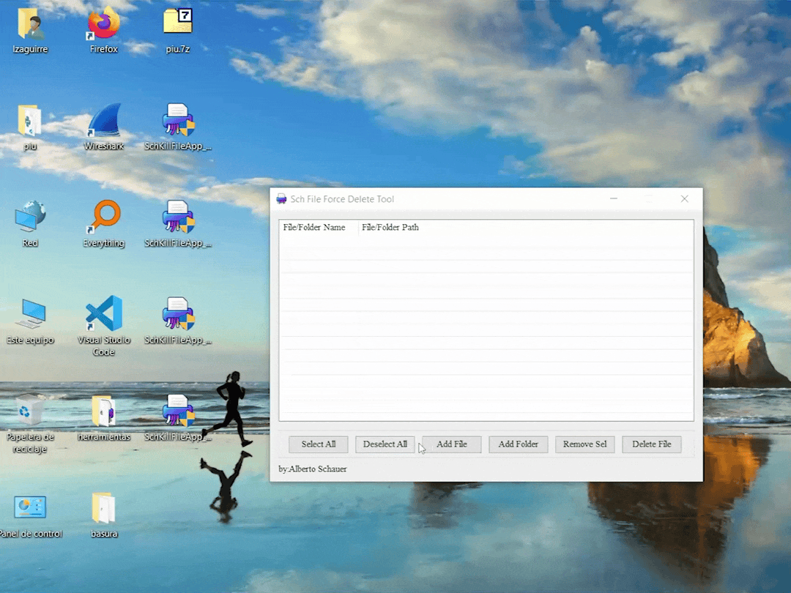

# SchKillFile – Force Delete Locked Files and Folders (Kernel Mode)

**SchKillFile** is a Windows application that allows you to forcibly delete files and folders that are locked or in use by other processes. It leverages a custom kernel-mode driver to bypass user-mode restrictions, ensuring deletion of otherwise undeletable resources. This tool is designed for advanced users, developers, and system administrators who understand the risks of low-level system operations.

---

## ⚠️ Disclaimer

> **WARNING:** This tool interacts with Windows kernel-mode APIs and drivers. Improper use may lead to system instability or data loss. Only use it if you fully understand the implications.

> **Administrative privileges are required** to run this program, as it installs and loads a kernel-mode driver.

---

## 💡 Features

- Force delete files or folders that are locked, in use, or protected by system processes.
- Recursively delete all contents inside a folder.
- Support for x86, x64, ARM32, and ARM64 architectures.
- Simple GUI built with MFC framework.
- Drag-and-drop support for files and folders.
- Multi-selection and batch deletion.
- Dynamically deploys and removes kernel-mode driver at runtime.

---

### 🧰 Possible Use Cases

* **Remove stubborn malware files** that cannot be deleted through normal means.
* **Clean up temporary files** that are locked by hung or crashed processes.
* **Delete locked folders** from external drives or after application uninstall failures.
* **Bypass file locks** for debugging, reverse engineering, or forensic analysis.
* **Remove orphaned files** from interrupted installations or outdated system components.
* **Automated cleanup in development environments** where build artifacts are held open.

---

## 🖼️ Screenshot

*Tested on Windows 7 SP1 and Windows 10 22H2*
> 
> 

---

## 🚀 Getting Started

### Prerequisites

- Windows 7 or later (32-bit or 64-bit).
- Administrator privileges.
- Visual Studio (for compilation).
- Driver signing enforcement should be disabled (for development/testing).

### Usage

1. Run `SchKillFile.exe` as Administrator.
2. Use the **Add File** or **Add Folder** buttons to queue entries.
3. (Optional) Use drag-and-drop to add files/folders.
4. Click **Select All** or choose individual items.
5. Click **Delete File** to forcibly delete the selected entries.

---

## ⚙️ How It Works (Technical Overview)

* The app extracts a driver binary from resources (`.sys` file).
* Registers and starts the driver as a Windows service via the Service Control Manager (SCM).
* Communicates with the driver via `DeviceIoControl()` using custom IOCTL codes:

  * `IOCTL_DELETEFILE`: Delete a file.
  * `IOCTL_DELETEFOLDER`: Recursively delete a folder and its contents.
* The kernel driver opens file handles with `IoCreateFile`, sets the `DeleteFile` flag using `IRP_MJ_SET_INFORMATION`, and forcibly deletes the resource.
* Image/data section objects are released to avoid sharing violations (e.g., for running executables).
* All folder contents are deleted recursively before attempting to remove the folder itself.

---

## 🔐 Security and Limitations

* This tool bypasses normal Windows file protections.
* Can delete system-critical files if misused.
* The driver is using **self-signed certificates** by default. WHQL signing is required for production use.
- Files opened by other processes **without `FILE_SHARE_DELETE`** cannot be opened by the driver and will remain locked.
- Files or folders with **memory-mapped sections** still held by kernel or filter drivers may fail to delete until unmapped.
- **File system filter drivers** (antivirus, EFS, backup filters) can intercept or block deletion requests.
- Very **long paths** (> 260 chars) or names exceeding the fixed 512-WCHAR buffers in the driver may cause failures or truncation.
- **Network/UNC paths** are not supported—only local NT namespace (`\Device\…`/`\??\…`) is handled.
- Directory deletion is done in batches of `PAGE_SIZE` entries; extremely large folders may exceed the buffer and require multiple passes.
- All deletion IRPs run at **PASSIVE_LEVEL**; any operation initiated at higher IRQLs will be rejected.
- Error reporting is limited—silent skips can occur on nested or deeply locked directory structures.

---

## 👤 Author

**Alberto Schauer**
GitHub: [@nuloperrito](https://github.com/nuloperrito)

---

## 📜 License

This project is released under the MIT License. See [LICENSE](LICENSE) for details.
