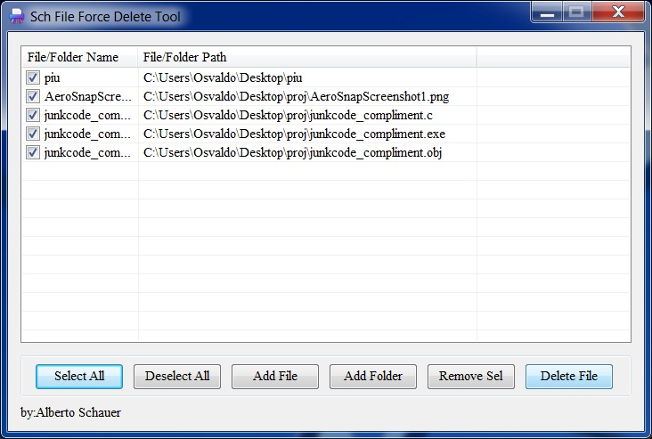
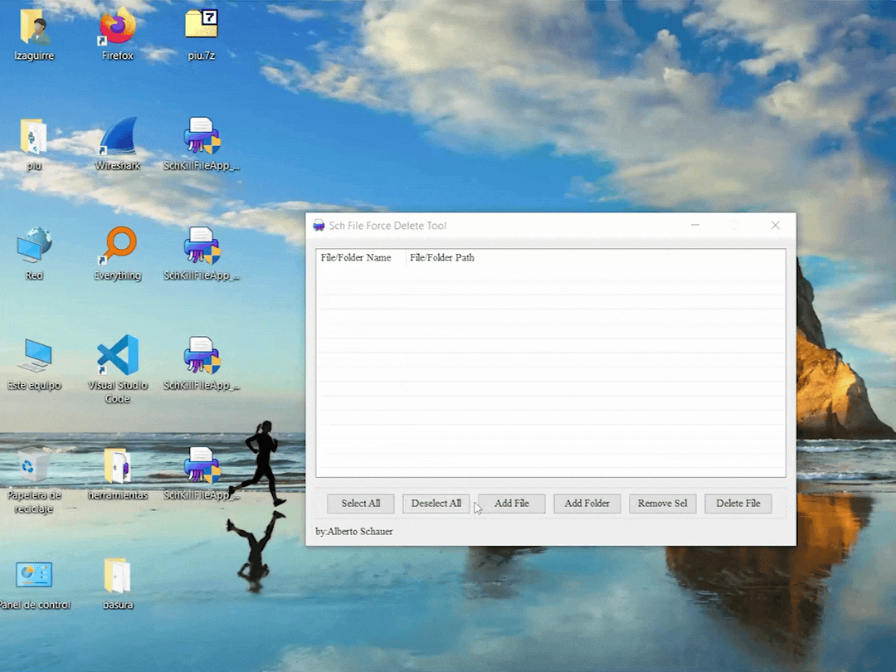

# SchKillFile – Force Delete Locked Files and Folders (Kernel Mode)

**SchKillFile** is a Windows application that allows you to forcibly delete files and folders that are locked or in use by other processes. It leverages a custom kernel-mode driver to bypass user-mode restrictions, ensuring deletion of otherwise undeletable resources. This tool is designed for advanced users, developers, and system administrators who understand the risks of low-level system operations.

---

## ⚠️ Disclaimer

> **WARNING:** This tool interacts with Windows kernel-mode APIs and drivers. Improper use may lead to system instability or data loss. Only use it if you fully understand the implications.

> **Administrative privileges are required** to run this program, as it installs and loads a kernel-mode driver.

---

## 💡 Features

- Bypasses traditional file locks by operating deletion within the Windows kernel.
- Automatically identifies and closes system-wide handles pointing to target files.
- Terminates processes holding exclusive locks on files, with built-in protections for critical system processes to prevent Blue Screen of Death (BSOD) events.
- Implements a converging iterative deletion algorithm to remove complex directory structures.
- If immediate kernel-mode deletion fails, the file can be scheduled for deletion during the next system boot.
- Support for x86, x64, ARM32, and ARM64 architectures.
- Simple GUI built with MFC framework.
- Drag-and-drop support for files and folders.
- Multi-selection and batch deletion.
- Dynamically deploys and removes kernel-mode driver at runtime.

---

### 🧰 Possible Use Cases

* **Remove stubborn malware files** that cannot be deleted through normal means.
* **Clean up temporary files** that are locked by hung or crashed processes.
* **Delete locked folders** from external drives or after application uninstall failures.
* **Bypass file locks** for debugging, reverse engineering, or forensic analysis.
* **Remove orphaned files** from interrupted installations or outdated system components.
* **Automated cleanup in development environments** where build artifacts are held open.

---

## 🖼️ Screenshot

*Tested on Windows 7 SP1 and Windows 10 22H2*
> 
> 

---

## 🚀 Getting Started

### Prerequisites

- Windows 7 or later (32-bit or 64-bit).
- Administrator privileges.
- Visual Studio (for compilation).
- Driver signing enforcement should be disabled (for development/testing).

### Usage

1. Run `SchKillFile.exe` as Administrator.
2. Use the **Add File** or **Add Folder** buttons to queue entries.
3. (Optional) Use drag-and-drop to add files/folders.
4. Click **Select All** or choose individual items.
5. Click **Delete File** to forcibly delete the selected entries.

---

## ⚙️ How It Works (Technical Overview)

### Application Layer

The application acts as the control center, managing the lifecycle of the kernel driver. Upon startup, it detects the host's processor architecture and extracts the corresponding driver binary (`.sys`) from its internal resources. It then installs and starts the driver as a system service. Communication with the driver is handled via specialized I/O Control (IOCTL) codes transmitted through `DeviceIoControl`.

### Kernel-Mode Driver

The driver component performs the "heavy lifting" through several sophisticated mechanisms:

1. **Handle Analysis**: The driver uses `ZwQuerySystemInformation` to take a snapshot of every active handle in the system. It filters these handles to find those referencing the target file path.
2. **Forced Unlocking**: Once a lock is identified, the driver attaches to the owning process's memory space, forcefully closes the handle, and terminates the process unless it is identified as a critical system process.
3. **Cache & Image Flushing**: Before deletion, the driver purges the system's cache and flushes image sections (`CcPurgeCacheSection` and `MmFlushImageSection`) to ensure the file is no longer mapped in memory.
4. **IRP-Based Deletion**: The actual deletion is performed by manually constructing and sending I/O Request Packets (IRPs) directly to the file system's device stack, setting the `FileDispositionInformation` to true.
5. **Iterative Folder Deletion**: For directories, the driver uses a BFS scan to map the entire sub-tree and then executes a converging deletion loop to remove children before their parents.
---

## 🔐 Security and Limitations

- Can delete system-critical files if misused.
- The driver is using **self-signed certificates** by default. WHQL signing is required for production use.
- Files or folders with **memory-mapped sections** still held by kernel or filter drivers may fail to delete until unmapped. And deeply integrated system files may remain locked despite kernel-mode intervention. Both requiring the "Delete on Reboot" fallback.
- **File system filter drivers** (antivirus, EFS, backup filters) can intercept or block deletion requests.
- Very **long paths** (> 260 chars) or names exceeding the fixed 512-WCHAR buffers in the driver may cause failures or truncation.
- The current implementation is optimized for local NTFS/FAT32 volumes and may not behave identically on network-attached storage or specialized virtual volumes. **Network/UNC paths** are not supported, while only local NT namespace (`\Device\…`/`\??\…`) is handled.
- All deletion IRPs run at **PASSIVE_LEVEL**; any operation initiated at higher IRQLs will be rejected.

---

## 📜 License

This project is released under the MIT License. See [LICENSE](LICENSE) for details.
